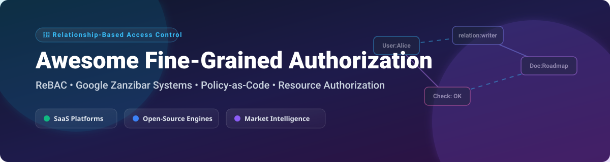

# Awesome Fine-Grained Authorization (FGA) 🔐

   

> **Curated List of Fine-Grained Authorization (FGA), Relationship-Based Access Control (ReBAC), Zanzibar Engines & Policy-as-Code Solutions 🚀**

## 💡 Overview & Market Landscape 🌐

Fine-Grained Authorization (FGA) answers complex permission queries at the object level (e.g., *"Can User X perform Action Y on Resource Z?"*). Driven by modern microservice architectures, multi-tenant SaaS requirements, and security compliance, authorization logic has decoupled from application monoliths into centralized relationship stores and decision runtimes.

> 📊 **Estimated Market Size & Structure**: The global Authorization-as-a-Service and Identity Governance market is estimated at **$3.2 Billion in 2026** with a project CAGR of ~22%. The market is **moderately fragmented**: while foundational standards (like Open Policy Agent and Google Zanzibar principles) dominate architectural mindshare, specialized commercial vendors compete intensely across managed ReBAC, policy distribution, and cloud identity integration.

---

## 📑 Table of Contents 📖

- [☁️ SaaS & Managed Hosted Platforms](#-saas--managed-hosted-platforms)
- [⚡ Open-Source GitHub Projects](#-open-source-github-projects)
- [🤝 How to Contribute](#-how-to-contribute)
- [📈 Star History](#-star-history)
- [💖 Support & Sponsorship](#-support--sponsorship)
- [⚠️ Disclaimer](#%EF%B8%8F-disclaimer)

---

## ☁️ SaaS & Managed Hosted Platforms 🏢

Below is a curated comparison of leading commercial Fine-Grained Authorization SaaS platforms, sorted by estimated company scale (annual revenue/valuation):

| Platform | Description | Key Features | Pricing (Starting Paid Tier) | Free Tier Limits / Trial | Company Scale (Rev / Val) 📈 |
| :--- | :--- | :--- | :--- | :--- | :--- |
| **[Styra DAS](https://www.styra.com/)** | Commercial management platform built around Open Policy Agent (OPA). | Enterprise policy distribution, compliance logging, decision audit trails. | Custom enterprise pricing (or ~$70/mo starter entry) | 14-day full free trial of enterprise DAS | **~$12M+ Rev** / **$67.5M Funding** |
| **[Oso Cloud](https://www.osohq.com/)** | Managed authorization engine using the Polar declarative policy language. | Embedded checks, global distribution, fast relationship resolution. | **$149/month** (Pro plan per 1M checks) | Free tier available (up to 1M checks/mo for dev) | **~$7.6M Rev** / **$26M Funding** |
| **[Cerbos Hub](https://www.cerbos.dev/)** | Cloud platform for managing, testing, and deploying Cerbos policy runtimes. | Policy playground, CI/CD pipeline integration, fleet telemetry. | **$25/month** (Dev tier for first 100 active principals) | Free tier available for small workloads | **~$1.6M Rev** / **$11M Funding** |
| **[Permit.io](https://www.permit.io/)** | Full-stack application authorization platform with low-code UI and Audit logs. | ReBAC/ABAC/RBAC support, low-code policy editor, real-time sync. | **$150/month** (Startup plan up to 10,000 active users) | Community Free-Forever Plan (up to 1,000 users) | **~$1.5M Rev** / **$8M Funding** |
| **[AuthZed (SpiceDB Cloud)](https://authzed.com/)** | Serverless managed SpiceDB database for scalable relationship permission stores. | High consistency guarantees, gRPC/REST APIs, enterprise Zanzibar SLA. | **$2/hour** (~$1,440/mo base for Serverless SpiceDB) | Free trial tier with credit allocation for dev | **~$1.2M Rev** / **~$10M Funding** |
| **[Auth0 FGA](https://fga.dev/)** | Okta Auth0 managed relationship-based access control engine built on OpenFGA. | Auth0 identity integration, relationship tuples, enterprise security. | Custom Enterprise Contract via Auth0/Okta sales | Free Trial: 100 MAU, 10 Stores, 50k Tuples, 20 Check req/sec | **Okta Sub-Unit** ($2.4B+ Parent Rev) |
| **[Aserto](https://www.aserto.com/)** | Developer-focused cloud authorization service leveraging Topaz & OPA runtimes. | Directory sync, CLI deployment tools, visual authorization modeler. | **$0.20/user/month** (Essentials plan) | Starter Free Plan: 1,000 users & 50 policy repos | **VC-backed startup** |

---

## ⚡ Open-Source GitHub Projects 🛠️

Top open-source authorization engines, libraries, and policy runners sorted by **GitHub Stars_Count** (descending):

| Repository | GitHub_Stars ⭐ | Description | License |
| :--- | :--- | :--- | :--- |
| **[Casbin](https://github.com/casbin/casbin)** |  | Powerful and efficient open-source access control library supporting ACL, RBAC, ABAC, and RESTful permissions. | Apache-2.0 |
| **[Open Policy Agent (OPA)](https://github.com/open-policy-agent/opa)** |  | CNCF graduate general-purpose policy engine for unified policy enforcement across microservices, Kubernetes, & CI/CD. | Apache-2.0 |
| **[SpiceDB](https://github.com/authzed/spicedb)** |  | Open-source Zanzibar-inspired authorization database created by AuthZed for high-throughput ReBAC. | Apache-2.0 |
| **[Permify](https://github.com/permify/permify)** |  | Open-source authorization service based on Google Zanzibar for creating multi-tenant ReBAC permissions. | Apache-2.0 |
| **[OpenFGA](https://github.com/openfga/openfga)** |  | CNCF authorization engine designed for high-performance relationship-based access control (ReBAC). | Apache-2.0 |
| **[Cerbos](https://github.com/cerbos/cerbos)** |  | Context-aware open-source policy decision point engine with YAML declarative policies. | Apache-2.0 |
| **[Oso](https://github.com/osohq/oso)** |  | Batteries-included open-source authorization library using the Polar policy language. | Apache-2.0 |
| **[Cedar](https://github.com/cedar-policy/cedar-policy)** |  | Fast, expressive, and formally verified authorization policy language & SDK open-sourced by AWS. | Apache-2.0 |
| **[Topaz](https://github.com/aserto-dev/topaz)** |  | Open-source authorization engine combining OPA policy evaluation with built-in directory store. | Apache-2.0 |
| **[PyCasbin](https://github.com/pycasbin/pycasbin)** |  | Python implementation of Casbin for application-level access control. | Apache-2.0 |

---

## 🤝 How to Contribute 📝

Contributions are welcome! Please follow these simple guidelines:

1. Fork this repository. 🍴
2. Create your feature branch (`git checkout -b feature/add-fga-tool`).
3. Ensure factual descriptions, verified starting prices, or exact GitHub repository URLs.
4. Commit your changes and open a Pull Request. pull request guidelines follow standard [Awesome List conventions](https://github.com/ishandutta2007/Awesome-Awesome-Awesome).

---

## 📈 Star History 📊

---

## 💖 Support & Sponsorship ☕

If you found this curated list helpful for evaluating Fine-Grained Authorization architectures or selecting a security platform, please consider showing your support:

- ⭐ **Star this repository** to help others discover it!
- 🔀 **Fork & Share** it with your application security and engineering peers.
- ☕ **Buy me a coffee**: Support ongoing open-source curation via the [GitHub Sponsor Dashboard](https://github.sponsors/ishandutta2007) or [Sponsor Ishan Dutta](https://github.com/sponsors/ishandutta2007).

Thank you for supporting open-source software and security tooling! 🙌

---

## ⚠️ Disclaimer 🔒

- This list is **community-curated** for research and educational purposes.
- Authorization logic is security-critical. Always perform thorough security assessments, audit relationship models, and conduct load testing before deploying permission systems to production environments.
